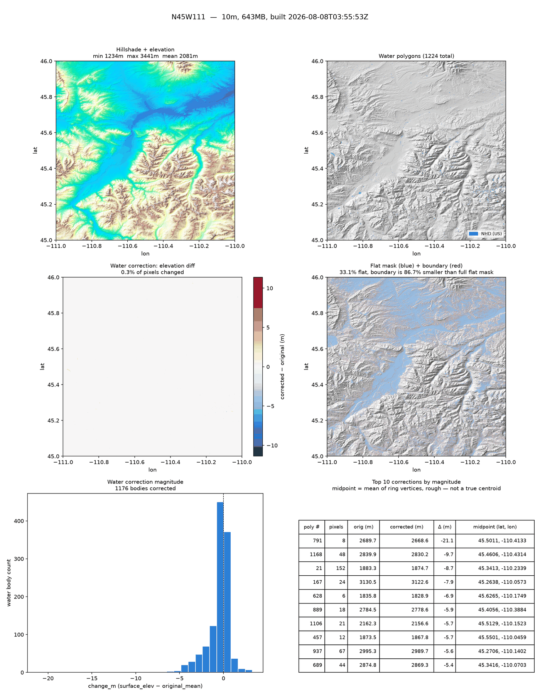

# DEM Download & Tile Pipeline

Downloads, repairs, and mosaics Digital Elevation Model (DEM) data from public
US and global sources, and turns it into a validated, cache-managed tile
corpus suitable for large-scale terrain compute.

This is an extracted slice of the DEM-preparation layer from a larger private
project.

## What it does

Two generations of code live here, in the order they were built:

**1. Flat pipeline scripts** — download a DEM for a latitude-longitude grid spanning input diagonal corners, then run standalone repair/correction passes
over the result:

| Script | Purpose |
|---|---|
| [`dem_download.py`](python/dem_download.py) | Downloads and mosaics the best available DEM tiles for a study area (3DEP 1m → 3DEP 10m → GLO-30, in priority order). |
| [`build_dem_mosaic.py`](python/build_dem_mosaic.py) | Higher-level driver: downloads a source (GLO-30 or 3DEP) and produces one water-corrected mosaic GeoTIFF. |
| [`dem_water_correction.py`](python/dem_water_correction.py) | Flattens elevation noise inside still-water bodies (lakes, ponds, reservoirs) by sampling shoreline elevation and flood-filling, using NHD (US) or OpenStreetMap (global) water polygons. |
| [`repair_dem_gaps.py`](python/repair_dem_gaps.py) | Finds nodata/zero gaps in an already-built mosaic and backfills them from GLO-30, then re-applies water correction. |
| [`precompute_flat_mask.py`](python/precompute_flat_mask.py) | Precomputes a per-pixel "is this terrain locally flat" mask. |
| [`elevation.py`](python/elevation.py) | On-demand single-tile/single-point DEM lookup with its own disk cache — a separate download path from `dem_download.py`'s study-area pipeline, used internally by `build_dem_mosaic.py` and `repair_dem_gaps.py`. Adds sub-tiled 3DEP WCS downloads and a single-point `get_elevation()` that neither of those has. |
| [`gpu_tools.py`](python/gpu_tools.py) | CuPy-backed GPU acceleration helpers (dilation, percentile, water-correction label processing) with automatic fallback to NumPy/SciPy when no GPU is available. |
| [`parallel_tools.py`](python/parallel_tools.py) | Domain-agnostic multiprocessing helpers (shared-memory arrays, chunked/worker-pool map) used by the scripts above. |

**2. Tile-based system** — built on top of the flat scripts to serve terrain
on demand, one 1°×1° tile at a time, with a persistent on-disk cache:

| Module | Purpose |
|---|---|
| [`tile_id.py`](python/tile_id.py) | Pure coordinate math: lat/lng ↔ tile ID (`N45W110`), bounding-box/polyline coverage, neighbor lookup. No I/O. |
| [`tile_registry.py`](python/tile_registry.py) | JSON manifest of every known tile and its build state (`ready` / `pending` / `failed` / `absent`), with atomic save. |
| [`storage_manager.py`](python/storage_manager.py) | Enforces a disk-space cap on the tile cache before each build, with `hard` (refuse), `lru` (evict oldest), or `warn` policies. |
| [`tile_validation.py`](python/tile_validation.py) | Verifies a written DEM raster actually covers its tile's full 1°×1° footprint at the expected resolution — added after a real incident where a silently truncated download sat marked `ready` for 6+ weeks (see the module docstring for the full postmortem). |
| [`tile_builder.py`](python/tile_builder.py) | Orchestrates one tile end-to-end: download → crop/gap-fill → extent validation → water correction → flat mask → boundary mask → registry update. Composes the flat scripts above rather than reimplementing them. |
| [`visualize_tile.py`](python/visualize_tile.py) | Renders a diagnostic figure for a built tile — hillshade/elevation, water polygons, the water-correction diff, flat/boundary coverage, the gap-fill void map, and a correction-magnitude summary. See [Visualizing a tile](#visualizing-a-tile) below. |

**Tile ID convention:** the coordinate in a tile ID is its **southwest
corner** — the tile extends north and east from there. `N45W110` covers
45–46°N by 110–109°W (i.e. north to 46°N, *east* to 109°W, not 111°W —
easy to misread at a glance). `tile_bounds('N45W110')` in
[`tile_id.py`](python/tile_id.py) is the source of truth if you want to
double-check a specific tile.

## Setup

```bash
python3 -m venv .venv
.venv/bin/pip install -r python/requirements.txt
```

(`.venv/bin/pip`/`.venv/bin/python` work as-is in any shell. If you'd
rather activate the venv so plain `python`/`pip` resolve to it, use
`source .venv/bin/activate` in bash/zsh or `source .venv/bin/activate.fish`
in fish.)

GPU acceleration (`gpu_tools.py`) is optional — it falls back to NumPy/SciPy
automatically. To enable it, additionally install a CUDA-matched CuPy build,
e.g. `pip install cupy-cuda12x`.

## Usage

```bash
# Download + mosaic a whole area at the best available resolution.
# The area is the rectangle spanning any two opposite 1°x1° tile
# corners (see "Tile ID convention" above) -- order doesn't matter.
python python/dem_download.py N44W113 N47W109
python python/dem_download.py --bounds 44,-113,47,-109  # fractional-degree alternative

# Or, via the higher-level mosaic driver
python python/build_dem_mosaic.py N44W113 N47W109
python python/build_dem_mosaic.py --bounds 44 -113 47 -109 --output my_area.tif

# Build one 1°x1° tile end-to-end into a local tile cache. --storage-root
# is the cache root, not the tiles dir itself — the tile lands at
# data/tiles/N45W110/ (registry + downloads/ also live under data/).
# N45W110 names the tile's SW corner (45N, 110W) — see "Tile ID
# convention" above.
python python/tile_builder.py build N45W110 --storage-root data

# Same, but also keep the pre-correction/pre-fill artifacts that
# visualize_tile.py's diff panels need (see below) — costs extra disk
python python/tile_builder.py build N45W110 --storage-root data --keep-original

# Repair nodata gaps in an existing mosaic
python python/repair_dem_gaps.py N44W113 N47W109 --dem-path my_area.tif --dry-run

# Correct water-body elevation noise in a single tile
python python/dem_water_correction.py correct \
    --input data/dem/raw/N45_00_W111.tif \
    --output data/dem/corrected/N45_00_W111.tif \
    --source osm
```

Areas built from two tile corners are capped at 25 degree-tiles by
default (`--allow-large` to override) — `dem_download.py`, `build_dem_mosaic.py`,
and `repair_dem_gaps.py` all warn/refuse before a mosaic gets large
enough to be a real time/disk commitment; each 3DEP 10m tile runs
roughly 200-300MB. See `bounds_from_tile_corners()` in `tile_id.py`.

Run any script with `--help` for its full option list — all of them are
self-documenting argparse CLIs.

## Visualizing a tile

```bash
python python/visualize_tile.py N45W110 --storage-root data
```

Reads a tile on disk under the directory and renders a
one-page PNG report (default: `<tile_dir>/<tile_id>_report.png`). Needs `rasterio` and `matplotlib`, no network access, no scipy/
shapely/GPU deps.

Every panel is optional except the base hillshade — a panel is skipped
(with a one-line explanation printed to the console) rather than faked
when its input artifact isn't there:

| Panel | Needs |
|---|---|
| Hillshade + elevation | `{tile}_dem.tif` (the only required file) |
| Water polygons, colored by source | `{tile}_water.geojson` |
| Flat mask + boundary overlay | `{tile}_flat.tif`, `{tile}_boundary.tif` |
| Elevation diff (corrected − original) | `{tile}_dem_precorrection.tif` † |
| Void map (gap-fill before/after) | `{tile}_gap_mask.tif` † |
| Correction magnitude histogram + top-N table | `{tile}_water_stats.json` † |

† `tile_builder.py`'s water-correction and gap-fill steps normally run
in place — there's no "before" raster left over once a tile is built.
Pass `--keep-original` at build time (see above) to have `tile_builder.py`
save these three extra artifacts alongside the normal ones.

**Example**, from a real tile (`N45W111`, Yellowstone/Hebgen Lake area,
NHD source, `--keep-original`):



The top-10 table exists to give visibility into how large water corrections
get. An earlier build of this same tile is what surfaced a real bug: an
8-pixel sliver of misclassified "water" on a steep hillside was getting a
**-21.1m** correction, because its shoreline ring sampled straight down the
slope instead of an actual shoreline. Fixed in both `dem_water_correction.py`
and `.R` by gating on the resulting correction magnitude rather than trusting
every water polygon's own geometry — corrections over `max_correction_m`
(default 10m) are now skipped instead of applied, and corrections built from
a water body whose *own* raw elevation was already noisy are applied but
marked `low_confidence` rather than silently treated the same as a clean
one. The `midpoint (lat, lon)` column still exists for spot-checking any
correction directly.

## Tests

Each module has a matching `test_*.py` that runs standalone (no pytest
required):

```bash
cd python
python test_tile_id.py
python test_tile_registry.py
python test_storage_manager.py
python test_tile_validation.py
python test_tile_builder.py
```

`test_tile_builder.py` stubs out the flat pipeline scripts (`dem_download`,
`precompute_flat_mask`, etc.) so the tile-orchestration logic can be tested
without a network connection or real DEM data.

## R port

[`r/`](r/) has an R translation of the core DEM science — download,
mosaic, still-water correction, flat-mask computation, and the
on-demand single-tile lookup in `elevation.py` — built on `terra` and
`httr2`. It's a deliberately narrower port than the Python original
(no tile-cache infrastructure, no GPU/parallel paths — see
[`r/README.md`](r/README.md) for the exact scope and why), verified
against real NHD/OSM API calls, real downloads, and a real R-vs-Python
mosaic diff for the same area. Translating it surfaced several real bugs, all documented in
[`r/README.md`](r/README.md#real-bugs-found-while-writing-this-port)
with the live incident that caught each one — most notably a
truncated-download detection gap that **also existed in this repo's
own Python original** and a 3DEP
sub-tile grid-alignment issue that, before the fix, made the two
ports' output for the same real area disagree on a majority of pixels.

## Scope / known gaps

This repo is a working slice of a larger pipeline. It can serve as a useful data input tool in terrain analyses.

## Data sources

All public, no API keys or credentials required:

- [USGS 3DEP](https://www.usgs.gov/3d-elevation-program) (1m / 10m, US
  coverage) via the National Map API and public S3 bucket
- [Copernicus GLO-30](https://registry.opendata.aws/copernicus-dem/) (30m,
  global) via public S3
- [USGS National Hydrography Dataset](https://www.usgs.gov/national-hydrography)
  (water polygons, US)
- [OpenStreetMap](https://www.openstreetmap.org/) via the Overpass API
  (water polygons, global)
